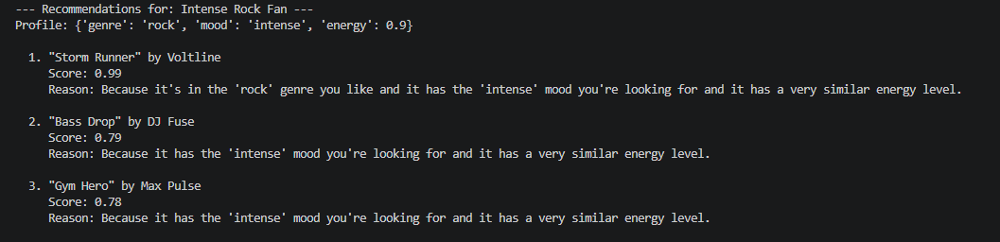
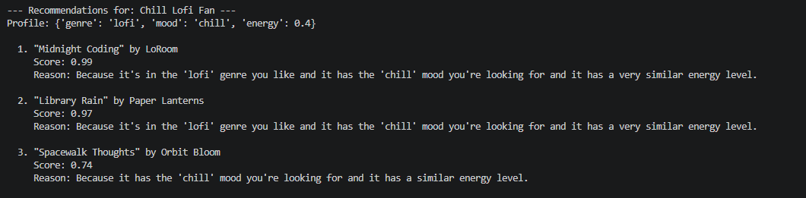
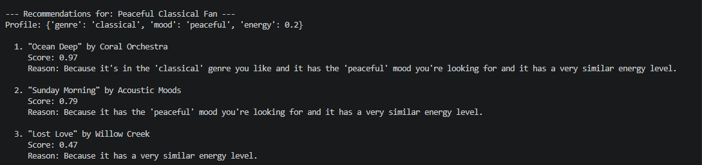

# 🎵 Music Recommender Simulation

## Project Summary

This project builds a small content-based music recommender that ranks songs from `data/songs.csv` based on a user's preferred genre, mood, and energy level. It shows how recommendation systems turn simple song features into personalized suggestions and how different user profiles can produce different results.

---

## How The System Works

This recommender uses a **content-based filtering** approach. For each user profile, it compares every song in the catalog with the user's preferred genre, mood, and target energy.

- **Song features used:** The main scoring logic uses `genre`, `mood`, and `energy` from `data/songs.csv`.
- **User profile information:** The user profile stores the preferred genre, preferred mood, and target energy, for example `{"genre": "pop", "mood": "happy", "energy": 0.8}`.
- **Scoring mechanism:** Each song gets an individual score for genre, mood, and energy. Genre and mood are binary matches, while energy is scored by proximity using `1 - abs(user_preference - song_value)`.
- **Weighted total:** The final score is a weighted average:

  `Total Score = (0.2 * genre_score) + (0.3 * mood_score) + (0.5 * energy_score)`

- **Choosing recommendations:** After scoring the full catalog, the system sorts songs from highest to lowest score and returns the top results for that user.

---

## Getting Started

### Setup

1. Create a virtual environment (optional but recommended):

   ```bash
   python -m venv .venv
   source .venv/bin/activate      # Mac or Linux
   .venv\Scripts\activate         # Windows

   ```

2. Install dependencies

```bash
pip install -r requirements.txt
```

3. Run the app:

```bash
python -m src.main
```

### Running Tests

Run the starter tests with:

```bash
pytest
```

You can add more tests in `tests/test_recommender.py`.

---

## Experiments You Tried

The starter app tests several different user profiles to show how the rankings change:

- Happy Pop Fan
  
- Intense Rock Fan
  
- Chill Lofi Fan
  
- Peaceful Classical Fan
  

---

## Limitations and Risks

The current recommender has a few important limits:

- It only uses a small song catalog, so the recommendation space is limited.
- It only scores three features directly, so it ignores other useful signals like lyrics, artist popularity, or instrumentation.
- The heavy energy weight means the system can favor energy matches even when genre or mood are less aligned.
- The dataset can create bias if some genres or moods are underrepresented.

---

## Personal Reflection

Building this recommender made it easier to understand how platforms like Spotify and YouTube Music predict what users will love next. They do not rely on just one signal; they combine content-based filtering, which looks at the properties of a song, with behavior-based signals that come from how people actually use the platform.

In content-based filtering, the system compares a song's features to the kinds of songs a user already seems to like. In music apps, those features can include tempo, mood, energy, genre, valence, and sometimes acousticness or danceability. The broader prediction systems also use interaction data such as likes, skips, replays, playlist adds, search history, and listening time to guess what the user may enjoy next.

I also learned that bias in recommenders is not only about intent. It can come from what the system cannot see, such as lyrics, artist context, or why a user skipped a song. That makes human judgment important when choosing the data types, setting weights, and deciding whether the final recommendations are actually fair and useful.

### Pairwise Output Comparisons

- Happy Pop Fan vs Intense Rock Fan: both profiles prefer high energy, so both include Gym Hero as a cross-genre overlap, but the pop profile stays brighter and more melodic while the rock profile shifts toward heavier, more aggressive songs like Storm Runner and Bass Drop.
- Happy Pop Fan vs Chill Lofi Fan: the outputs move from upbeat pop songs to quieter study-style tracks, which makes sense because the lofi profile lowers the energy target and changes the mood from happy to chill.
- Happy Pop Fan vs Peaceful Classical Fan: the pop profile favors lively, modern tracks, while the classical profile shifts toward more serene songs like Ocean Deep and Sunday Morning, showing that lower energy and peaceful mood pull the recommendations away from pop.
- Intense Rock Fan vs Chill Lofi Fan: this is one of the clearest contrasts because the rock profile favors intense, high-energy songs, while the lofi profile favors soft, low-energy music. The outputs change from Storm Runner and Bass Drop to Midnight Coding and Library Rain, which is exactly what the preferences are testing for.
- Intense Rock Fan vs Peaceful Classical Fan: both profiles are specific about mood, but they point in opposite directions. The rock profile rewards intensity, while the classical profile rewards calmness, so the songs shift from loud, driving tracks to gentle, reflective ones.
- Chill Lofi Fan vs Peaceful Classical Fan: these two profiles are both mellow, so their outputs are closer in energy than the other pairs, but the genre preference still separates them. Lofi leans toward ambient, coding, and late-night listening, while classical leans toward orchestral, acoustic, and peaceful listening.

---

## Model Card

### 1. Model Name

VibeFinder CLI

### 2. Intended Use

This recommender suggests 3 to 5 songs from a small catalog based on a user's preferred genre, mood, and energy level. It is designed for classroom exploration and testing, not for real users or production use.

### 3. How It Works

The recommender compares each song in `data/songs.csv` to a user's preferences. Genre and mood are scored as matches or non-matches, while energy is scored by how close the song's energy is to the user's target. Those feature scores are combined with weights, and the highest-scoring songs are returned first.

### 4. Data

The catalog contains 20 songs. It includes genres such as pop, rock, lofi, classical, electronic, folk, hip-hop, reggae, ambient, acoustic, indie pop, and country, with moods like happy, chill, intense, peaceful, moody, and romantic. The dataset is still small, so it reflects only a narrow slice of musical taste.

### 5. Strengths

The system is simple and easy to explain. It works well when the user's taste can be described by genre, mood, and energy, and the explanations make it clear why a song was recommended.

### 6. Limitations and Bias

The recommender ignores lyrics, artist context, listening history, instrumentation, and many other signals people use when choosing music. It can also over-prioritize energy because that feature has the highest weight, which may favor some songs even when genre or mood are not as close.

### 7. Evaluation

I tested the CLI with several user profiles, including Happy Pop Fan, Intense Rock Fan, Chill Lofi Fan, and Peaceful Classical Fan. I checked whether the top results matched the expected genre and mood, and I used the explanation text to confirm that the ranking logic behaved as intended.

The results were mostly what I expected, but one thing that stood out was how often the energy weight pulled in cross-genre songs. For example, the Happy Pop and Intense Rock profiles both surfaced Gym Hero because it is high energy, while the Chill Lofi and Peaceful Classical profiles shifted toward calmer songs that matched the lower-energy mood of each profile. That made sense because the model is designed to reward energy strongly, but it also showed that the system is not just looking at genre alone.

No need for numeric metrics unless you created some.

### 8. Future Work

If I had more time, I would add more song features, improve diversity among the top results, tune the weights more carefully, and support richer user profiles or group recommendations.
